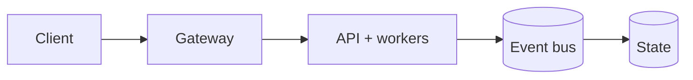
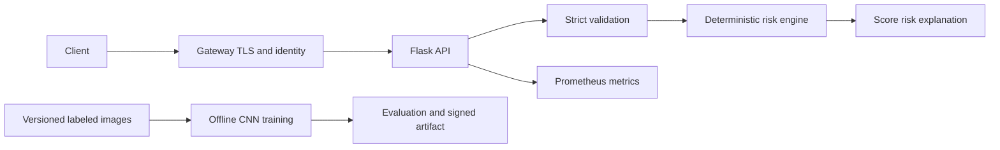

# AI Vehicle Safety Classifier

[](https://github.com/CoreyLeath-code/AI-Vehicle-Safety-Classifier/actions/workflows/ci.yml)
[](https://github.com/CoreyLeath-code/AI-Vehicle-Safety-Classifier/actions/workflows/security.yml)


[](LICENSE)

An interpretable vehicle-condition risk service with a separate CNN research pipeline. The
production-serving path validates weather, visibility, traffic, and driver state, then returns a
deterministic 0–100 safety score, risk level, and explanation. The CNN path is intentionally kept
offline until a versioned dataset and signed model artifact are available.

> This project is decision-support research, not a certified automotive safety system.


## Production Readiness Guide

> This section is the portfolio audit entry point for **AI-Vehicle-Safety-Classifier**. It describes an engineering promotion path; it is not a claim that the repository is already production-authorized.

[](https://github.com/CoreyLeath-code/AI-Vehicle-Safety-Classifier/actions) [](https://github.com/CoreyLeath-code/AI-Vehicle-Safety-Classifier/blob/main/LICENSE)

### Architecture flowchart



### Quickstart and local validation

The supported local path should be reproducible from a clean checkout. The inferred stack for this repository is **Python/platform services**.

```bash
python -m venv .venv && source .venv/bin/activate && pip install -r requirements.txt
pytest -q
```

If the project uses external services, model artifacts, cloud credentials, or private data, start them through documented local fixtures or mocks. Never place secrets or identifiable records in the repository.

### Research-style metrics and benchmarks

| Evidence | Required record |
|---|---|
| Correctness | Test command, commit SHA, runtime, and pass/fail result |
| Performance | Warm-up, sample count, concurrency, median, p95, p99, throughput, and memory |
| Data/model quality | Dataset version, split strategy, leakage controls, calibration, subgroup results, and uncertainty |
| Runtime | Image digest, health-check latency, resource limits, and rollback target |
| Security | Dependency, secret, SAST, container, and SBOM results |

A benchmark number belongs in a versioned artifact tied to a commit and hardware/runtime description. Engineering benchmarks must not be presented as clinical, financial, safety, or model-quality validation without the appropriate domain evidence.

### Extended Q&A

**What is production-ready for this repository?**  
A reproducible build, tested public contract, controlled configuration, observable runtime, documented security boundary, versioned artifacts, and a tested rollback path.

**What must remain explicit?**  
The intended use, excluded use, data/credential handling, model or algorithm limitations, and which metrics are measured versus aspirational.

**What should be completed next?**  
Use the linked production-readiness issue for this repository as the checklist. Resolve missing tests, deployment instructions, observability, supply-chain controls, and release evidence before attaching a production claim.


## Verifiable metrics dashboard

| Metric | Current source of truth | Acceptance |
|---|---|---:|
| Core branch coverage | CI `coverage.xml` artifact | >= 90% |
| CI status | live badge and workflow run | all required jobs pass |
| Benchmark date/runtime | `benchmarks/latest.json` provenance | generated for current commit |
| Average/median/p95/p99/min/max latency | benchmark JSON | measured, hardware-sensitive |
| Throughput and success rate | benchmark JSON | success rate = 100% |
| Peak Python memory | benchmark JSON | measured, not universal |
| Security findings | CodeQL, Bandit, pip-audit, Trivy | 0 blocking findings |
| Dependency/license inventory | `benchmarks/licenses.json` | artifact produced |
| Docker image and startup | deployment-validation job | build and health/API smoke pass |
| SBOM | `security-evidence` artifact | SPDX JSON produced |
| Repository size/LOC/open issues/releases | GitHub repository metadata | inspect live; not hard-coded |
| CNN accuracy/precision/recall/F1/ROC-AUC | unavailable | requires versioned labeled dataset |
| Training/GPU/loss/confusion matrix | unavailable | requires reproducible model run |

Numerical benchmark values are not copied into this README because runner hardware and dependency
updates change them. Every CI run attaches the exact measurement document to its commit.

## Research protocol

The benchmark sends a fixed, hashed request through Flask's test client after warm-up. It reports
average, median, p95, p99, minimum and maximum latency, requests/second, success rate, peak traced
Python memory, parameters, payload SHA-256, Python version, platform, and UTC timestamp.

```bash
python -m venv .venv
# Linux/macOS: source .venv/bin/activate
# Windows: .venv\Scripts\Activate.ps1
python -m pip install -r requirements-dev.txt
pytest
python benchmarks/run_benchmark.py --output benchmarks/latest.json
```

This measures application overhead without network/TLS effects. It does not establish 1–10,000
concurrent-user capacity or CNN model quality. See [the performance guide](docs/PERFORMANCE.md).

## API

```bash
gunicorn --bind 127.0.0.1:5000 n8n_webhook:app

curl http://127.0.0.1:5000/health
curl http://127.0.0.1:5000/metrics
curl -X POST http://127.0.0.1:5000/n8n/classify \
  -H "content-type: application/json" \
  -d '{"tool":"classify_conditions","input":{"weather":"rain","visibility":"low","traffic":"heavy","driver_state":"drowsy"}}'
```

Accepted values:

| Field | Values |
|---|---|
| weather | clear, sunny, rain, snow, fog |
| visibility | high, medium, low |
| traffic | light, moderate, heavy |
| driver_state | alert, distracted, drowsy |

Unknown, missing, or extra fields fail closed with HTTP 422. Payloads are size-limited, requests are
rate-limited, errors are sanitized, and request count/latency histograms are exposed for Prometheus.

## Architecture



The separation keeps the deployed service small and independently reproducible. Read the
[architecture](docs/ARCHITECTURE.md) and [audit](docs/AUDIT.md) for trade-offs and residual risks.

## Deployment

```bash
docker compose up --build
kubectl apply -f network-policy.yaml -f deployment.yaml -f service.yaml
```

The image runs as UID 10001. Kubernetes enforces non-root execution, a read-only filesystem,
dropped capabilities, RuntimeDefault seccomp, resource limits, disabled service-account token,
startup/liveness/readiness probes, immutable version tags, and default-deny networking.

Nine promotion tiers cover formatting, linting, static analysis, unit tests, integration/API tests,
coverage, security, reproducible performance, and production deployment validation. See the
[deployment guide](docs/DEPLOYMENT.md) and [production checklist](docs/PRODUCTION_CHECKLIST.md).

## Documentation

- [Full repository audit](docs/AUDIT.md)
- [Architecture](docs/ARCHITECTURE.md)
- [Benchmark report](benchmarks/benchmark_report.md)
- [Performance guide](docs/PERFORMANCE.md)
- [Deployment and rollback](docs/DEPLOYMENT.md)
- [Security policy](SECURITY.md)
- [Contributing guide](CONTRIBUTING.md)
- [Code of Conduct](CODE_OF_CONDUCT.md)

## License

MIT. See [LICENSE](LICENSE).
