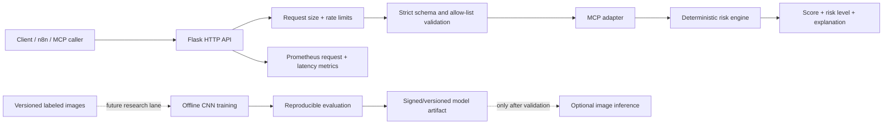
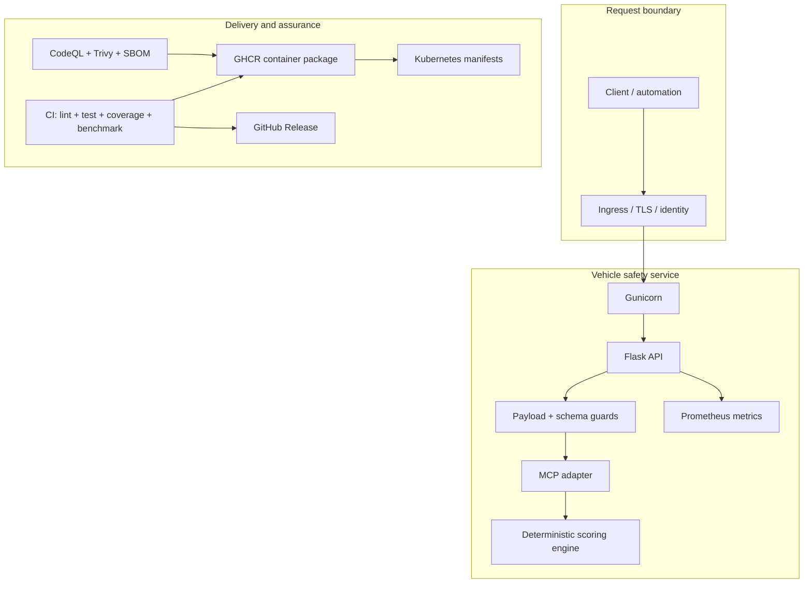

# AI Vehicle Safety Classifier

[](https://github.com/CoreyLeath-code/AI-Vehicle-Safety-Classifier/actions/workflows/ci.yml)
[](https://github.com/CoreyLeath-code/AI-Vehicle-Safety-Classifier/actions/workflows/security.yml)
[](https://github.com/CoreyLeath-code/AI-Vehicle-Safety-Classifier/actions/workflows/release.yml)
[](https://github.com/CoreyLeath-code/AI-Vehicle-Safety-Classifier/releases)


[](LICENSE)

A reproducible vehicle-condition risk service with an intentionally separate CNN research path. The deployed path does **not** infer from camera frames: it validates weather, visibility, traffic, and driver state, then returns an interpretable deterministic 0–100 safety score, risk band, and explanation. TensorFlow image inference remains offline until a versioned labeled dataset and model artifact can support reproducible model-quality claims.

> **Safety boundary:** this repository is engineering and decision-support research. It is not a certified automotive safety component and must not be used as the sole basis for emergency, legal, insurance, or autonomous-driving decisions.

## What is actually proven

The repository deliberately separates **measured engineering evidence** from **unverified model claims**.

| Evidence | Current status | Source of truth |
|---|---|---|
| Core API tests | 19/19 passing on the audited baseline | GitHub Actions `CI` |
| Core branch coverage | 96.03% on the audited baseline; enforced gate >=90% | `coverage.xml` CI artifact |
| Dependency audit | No known runtime dependency vulnerabilities on the audited baseline | `pip-audit` in CI |
| Static/security analysis | Ruff + Bandit pass | `CI` |
| Container validation | Non-root UID 10001, startup, health, readiness, API smoke test | `deployment-validation` |
| Kubernetes validation | Strict schema validation; no `latest`; read-only filesystem; service-account token disabled | `deployment-validation` |
| Supply chain | CodeQL, Trivy filesystem/image scans, SPDX SBOM | `Security and Supply Chain` |
| API performance | Measured by a versioned in-process benchmark; values below | `benchmarks/latest.json` CI artifact |
| CNN accuracy / F1 / ROC-AUC | **Not claimed** | Requires versioned dataset, split, trained artifact, and evaluation run |

### Audited baseline evidence

The last green `main` run inspected for this L6 audit used commit `49c6722be68bb7cc121e98f8304405d09c388530` on Ubuntu 24.04 with Python 3.11.16. It collected 19 tests, all passed in 0.63 s, and reported 96.03% core branch coverage. The same run reported no known vulnerabilities from `pip-audit`.

The benchmark in that run used 50 warm-up requests and 1,000 measured requests through Flask's in-process test client with a fixed hashed payload:

| Metric | Audited baseline |
|---|---:|
| Success rate | 100% |
| Median latency | 1.0764 ms |
| Average latency | 1.0951 ms |
| p95 latency | 1.1803 ms |
| p99 latency | 1.4806 ms |
| Min / max latency | 1.0189 / 2.1585 ms |
| Throughput | 909.74 requests/s |
| Peak traced Python memory | 376,893 bytes |

These numbers are **runner- and protocol-specific**, not a universal capacity claim. The benchmark excludes network, TLS, external load balancers, multi-process contention, and real CNN inference.

## Architecture flowchart


```mermaid
flowchart LR
    Client[Client / n8n / MCP caller] --> HTTP[Flask HTTP API]
    HTTP --> Limit[Request size + rate limits]
    Limit --> Validate[Strict schema and allow-list validation]
    Validate --> Adapter[MCP adapter]
    Adapter --> Risk[Deterministic risk engine]
    Risk --> Result[Score + risk level + explanation]
    HTTP --> Obs[Prometheus request + latency metrics]

    Data[Versioned labeled images] -. future research lane .-> Train[Offline CNN training]
    Train --> Eval[Reproducible evaluation]
    Eval --> Artifact[Signed/versioned model artifact]
    Artifact -. only after validation .-> Inference[Optional image inference]
```

The production path is intentionally small and deterministic. The CNN code is isolated behind lazy imports so the serving container does not pretend a trained image model exists when no versioned artifact is present.

## System design flowchart


```mermaid
flowchart TB
    subgraph Edge[Request boundary]
        Consumer[Client / automation]
        Ingress[Ingress / TLS / identity]
    end

    subgraph Service[Vehicle safety service]
        Gunicorn[Gunicorn]
        Flask[Flask API]
        Guard[Payload + schema guards]
        MCP[MCP adapter]
        Engine[Deterministic scoring engine]
        Metrics[Prometheus metrics]
    end

    subgraph Delivery[Delivery and assurance]
        CI[CI: lint + test + coverage + benchmark]
        Sec[CodeQL + Trivy + SBOM]
        Image[GHCR container package]
        K8s[Kubernetes manifests]
        Release[GitHub Release]
    end

    Consumer --> Ingress --> Gunicorn --> Flask --> Guard --> MCP --> Engine
    Flask --> Metrics
    CI --> Image
    Sec --> Image
    Image --> K8s
    CI --> Release
```

### Runtime failure policy

- Unknown, missing, or extra classification fields fail closed with HTTP 422.
- Non-JSON requests fail with HTTP 415.
- Invalid JSON object shape fails with HTTP 400.
- Unexpected server exceptions are logged internally and return a sanitized HTTP 500 response.
- Request bodies are size-limited and requests are rate-limited.
- `/live`, `/ready`, `/health`, and `/metrics` provide operational probes and observability.

## Quick start

### 1. Clone and create an environment

```bash
git clone https://github.com/CoreyLeath-code/AI-Vehicle-Safety-Classifier.git
cd AI-Vehicle-Safety-Classifier
python -m venv .venv
```

Linux/macOS:

```bash
source .venv/bin/activate
```

Windows PowerShell:

```powershell
.\.venv\Scripts\Activate.ps1
```

### 2. Install the reproducible development stack

```bash
python -m pip install --upgrade pip
python -m pip install -r requirements-dev.txt
```

### 3. Run the quality contract

```bash
ruff format --check predict.py mcp_adapter.py n8n_webhook.py benchmarks
ruff check predict.py mcp_adapter.py n8n_webhook.py benchmarks tests
bandit -q -r predict.py mcp_adapter.py n8n_webhook.py
pip-audit -r requirements-runtime.txt
pytest
python benchmarks/run_benchmark.py --iterations 1000 --warmup 50 --output benchmarks/latest.json
```

### 4. Run the API

```bash
gunicorn --bind 127.0.0.1:5000 n8n_webhook:app
```

In another terminal:

```bash
curl http://127.0.0.1:5000/health
curl http://127.0.0.1:5000/ready
curl http://127.0.0.1:5000/metrics
curl -X POST http://127.0.0.1:5000/n8n/classify \
  -H "content-type: application/json" \
  -d '{"tool":"classify_conditions","input":{"weather":"rain","visibility":"low","traffic":"heavy","driver_state":"drowsy"}}'
```

Expected classification fields:

```json
{
  "explanation": "High risk conditions detected. Driving is not recommended.",
  "risk_level": "high",
  "safety_score": 0
}
```

## API contract

| Field | Allowed values |
|---|---|
| `weather` | `clear`, `sunny`, `rain`, `snow`, `fog` |
| `visibility` | `high`, `medium`, `low` |
| `traffic` | `light`, `moderate`, `heavy` |
| `driver_state` | `alert`, `distracted`, `drowsy` |

The deterministic score subtracts explicit penalties from 100 and floors the result at 0. Risk bands are `low` for scores >=70, `medium` for scores >=40, and `high` otherwise. This makes every serving-path classification traceable to code rather than a hidden model decision.

## Reproducibility and hard evidence

The repository treats CI artifacts as evidence, not decoration.

```bash
pytest
python benchmarks/run_benchmark.py \
  --iterations 1000 \
  --warmup 50 \
  --output benchmarks/latest.json
python -m json.tool benchmarks/latest.json
```

The benchmark artifact records:

- warm-up count and measured iteration count;
- exact payload plus SHA-256 fingerprint;
- average, median, p95, p99, min, and max latency;
- throughput and request success rate;
- peak traced Python memory;
- Python version, platform, and UTC generation time.

CI also uploads `coverage.xml` and the dependency/license inventory. The security workflow independently produces an SPDX JSON SBOM and blocks high/critical Trivy findings under its configured policy.

### What is not yet reproducible

The repository contains CNN training/evaluation code, but it does not currently include a redistributable versioned image dataset and signed trained model artifact. Therefore the project does **not** publish CNN accuracy, precision, recall, F1, ROC-AUC, confusion-matrix, subgroup, calibration, or ablation numbers as established facts.

A model-quality claim becomes publishable only when one command can regenerate it from:

1. immutable dataset identity and license;
2. documented train/validation/test split and leakage controls;
3. fixed random seeds and dependency lock;
4. versioned training configuration;
5. saved model digest;
6. evaluation output including class support, uncertainty, and failure analysis.

## Research-style benchmark protocol

**Question.** What does the current benchmark measure?

It measures deterministic API-path overhead with Flask's test client for one fixed validated scenario.

**Null interpretation.** The benchmark does not establish production capacity, concurrent-user scaling, network latency, or CNN inference speed.

**Protocol.** Warm up the endpoint, execute a fixed number of requests, fail the run if any response is non-200, capture the latency distribution and traced Python memory, and serialize provenance to JSON.

**Repetition.** CI reruns the protocol on each qualifying commit so regression analysis can compare artifacts rather than rely on a single manually copied number.

**Threats to validity.** GitHub-hosted runner contention, interpreter/runtime updates, in-process transport, single payload selection, disabled benchmark rate limiting, and lack of network/TLS all limit external validity.

For production performance work, add container-level concurrent load testing with controlled CPU/memory limits, multiple repetitions, confidence intervals, and regression thresholds.

## Engineering Q&A

**Is this currently a computer-vision production service?**  
No. The serving API is a deterministic condition-risk engine. CNN image inference exists as an offline research path and is not represented as production-validated.

**Why keep deterministic scoring?**  
It is inexpensive, explainable, easy to test at boundaries, and useful as a stable service contract while model evidence is incomplete.

**Why not publish the old 0.927 accuracy / 0.907 F1 values?**  
Because the repository does not contain enough versioned evidence to regenerate them. L6-quality documentation prefers a smaller truthful claim over an impressive untraceable one.

**What makes the runtime reasonably hardened?**  
Strict inputs, bounded payloads, rate limiting, sanitized errors, health/readiness endpoints, metrics, a non-root image, read-only Kubernetes filesystem, dropped capabilities, resource limits, default-deny networking, CI security analysis, image scanning, and SBOM generation.

**What is still missing for internet-scale deployment?**  
Shared rate-limit state, an external identity/authentication boundary, TLS termination, distributed tracing, SLO/error-budget definitions, real concurrent load tests, signed image provenance/attestation, and a tested multi-replica rollout/rollback exercise.

**What is still missing for model deployment?**  
A licensed versioned dataset, reproducible training run, signed model artifact, calibrated thresholds, subgroup analysis, uncertainty handling, drift monitoring, and safety review against the intended operating domain.

## Engineering roadmap

### P0 — evidence integrity

- [x] Separate deterministic serving claims from CNN research claims.
- [x] Enforce >=90% core branch coverage.
- [x] Produce versioned benchmark artifacts with provenance.
- [x] Remove unsupported model-quality numbers from project documentation.
- [x] Validate container identity, startup, probes, API behavior, and Kubernetes manifests in CI.
- [x] Produce CodeQL/Trivy/SBOM supply-chain evidence.

### P1 — release engineering

- [x] Add a versioned GitHub Release + GHCR package workflow for `v1.1.0`.
- [ ] Add keyless artifact/image signing and provenance attestations.
- [ ] Add release checksum/SBOM attachment verification in a post-release job.
- [ ] Add rollback smoke testing against the previous immutable image digest.

### P1 — distributed runtime

- [ ] Move rate limiting from process-local memory to shared Redis for multi-replica deployments.
- [ ] Add gateway authentication/authorization and explicit trust-boundary tests.
- [ ] Add OpenTelemetry traces and structured correlation IDs.
- [ ] Define SLIs/SLOs for availability, latency, and error rate.
- [ ] Add container-level concurrent load and soak testing with regression thresholds.

### P2 — CNN research maturity

- [ ] Publish a licensed, immutable dataset manifest with hashes.
- [ ] Add deterministic train/validation/test split generation and leakage checks.
- [ ] Save training configuration, seeds, dependency lock, model digest, and full evaluation artifact.
- [ ] Report class support, precision, recall, F1, confusion matrix, calibration, and subgroup slices with uncertainty.
- [ ] Add controlled ablations only when every result is reproducible from code and artifacts.
- [ ] Promote image inference into the serving path only after those gates pass.

## Deployment

Build and run locally:

```bash
docker compose up --build
```

Validate/apply Kubernetes manifests:

```bash
kubectl apply -f network-policy.yaml -f deployment.yaml -f service.yaml
```

The production image runs as UID 10001. Kubernetes configuration enforces non-root execution, a read-only root filesystem, dropped Linux capabilities, `RuntimeDefault` seccomp, resource limits, disabled service-account token mounting, startup/liveness/readiness probes, an immutable image tag, and default-deny networking.

## Release and package

`v1.1.0` is the first evidence-hardened GitHub release. The release workflow publishes:

- a GitHub Release tied to the audited commit;
- an immutable commit-SHA container tag in GitHub Container Registry;
- the semantic `v1.1.0` GHCR tag;
- a release evidence file containing the commit and image references.

Package path after publication:

```text
ghcr.io/coreyleath-code/ai-vehicle-safety-classifier:v1.1.0
```

## Documentation

- [L6 engineering audit](docs/AUDIT.md)
- [Architecture](docs/ARCHITECTURE.md)
- [Performance guide](docs/PERFORMANCE.md)
- [Benchmark implementation](benchmarks/run_benchmark.py)
- [Deployment and rollback](docs/DEPLOYMENT.md)
- [Security policy](SECURITY.md)
- [Model evidence status](model_card.md)
- [Contributing guide](CONTRIBUTING.md)

## License

MIT. See [LICENSE](LICENSE).
