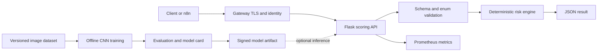

# Architecture

The reproducible deterministic engine is the serving boundary. CNN work stays offline until its
dataset and artifact are available, preventing startup dependency on TensorFlow and reducing the
production image's size and attack surface.
